# Lecture 1 
## Data Analytics Models
### Regression
- **input.**  <font color=red>Labeled</font> dataset with multiple features
- **Pattern.** <font color=red>Numerical value</font> as a function of other features

### Classification 
- **input.**  <font color=red>Labeled</font> dataset with multiple features
- **Pattern.** <font color=red>Categorical value</font> as a function of other features

### Clustering
- **input.**  Dataset with multiple features
- **Pattern.** Cluster of data based on specified **similarity** notion.

## Types of Data

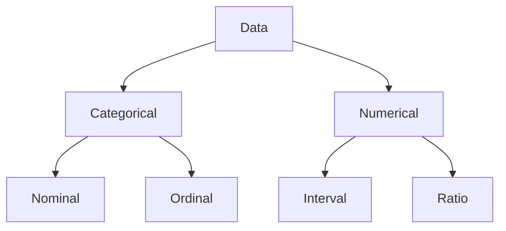
Nominal : 
- values are labels **without order**
- Operations : =, ≠  
- example: gender、colors

Ordinal :
- values are labels **with order**
- - Operations : =, ≠ ，< , >
- example: grades、degree
<br/>

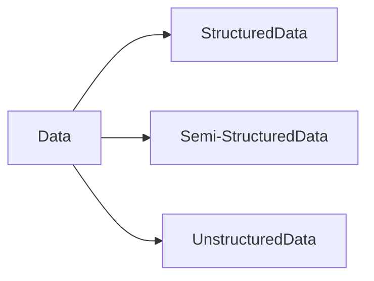


## The Rule of Thumb
### Table v.s. Plot
1. prefer a table over a chart if 
- You are interested in the **values**
- you want to compare **individuals rather than a trend**
- you require a **precision**
- your data comprises of **multiple units of measurement**
2. Do not use more than **3** dimensions inside a chart!
3. Do not rely on the readers to interpret the intended information that you want to convey!
4. Avoid to use 3D pictures, which gives false image for the viewers
5. Do not play with the intuition
6. Do not Lie

## Popular Visualizations
### Box Plot
to visualize **statistical tendancies**
### Scatter Plot
to visualize **relationship between two features**
### Line Plot
to visualize **trends** in the ordered data
### Bar Plot
to **compare different categories**
### Word Cloud
to compare **statistics of the words in a bag**
### Pie Chart
to compare **parts to whole**


# Tutorial 1 - Data Visualization using Matplotlib and Seaborn


## Small Points
```python
shows = pd.read_csv( "broadway_clean.csv" )
shows.head()

shows.shape # gives you the dimension of the data table in the form 
            # of (num_of_rows, num_of_columns)

shows.tail(18)
shows.describe()

# TODO: Select only the year, show name, and gross revenue columns
shows[['Date.Year','Show.Name','Statistics.Gross']]

# TODO: Select only rows with filled capacity of 50% or more
shows[shows['Statistics.Capacity']>=50]
``````

## Introduction to Matplotlib


### Introduction to Pyplot
```python
%matplotlib inline  # set %matplotlib inline magic to output
                    # the plotting commands inline in our notebooks.
import matplotlib.pyplot as plt
``````

### Basic Plot
A line plot is created using `pyplot.plot` and a scatter plot is created using `pyplot.scatter`.

```python
import numpy as np

# Generate 100 evenly spaced samples, calculated over the interval [0, 10].
x = np.linspace( 0, 10, 100 )  

plt.plot( x, np.sin(x), label="sin(x)" ) 

plt.scatter( x, x*x/100, c="Blue", marker="D", label="x^2 / 100" )

# Create a legend 
plt.legend() 

# Label the y and x axes
plt.ylabel( "Y" )
plt.xlabel( "X" )

# Configures grid lines to be visible
plt.grid( visible = True ) 

# Display the plot
plt.show()
``````
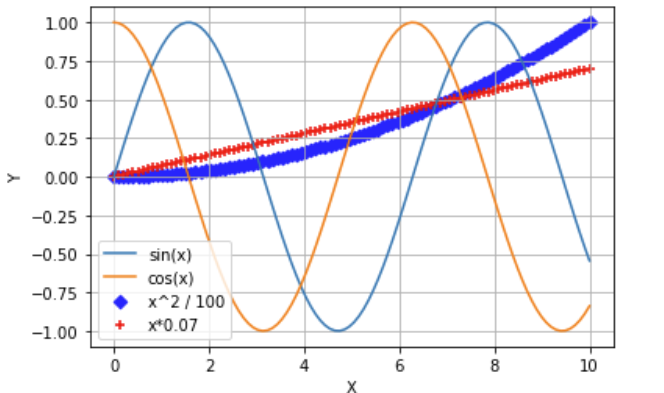


### Scatter Plot
Scatter plots are useful for **observing the relationship between two variables. **

Here, we use `pyplot.subplots` to give us a way to plot multiple plots on a single figure, which will come into play later.

```python
# subplots is a utility wrapper that makes it convenient to 
# get Figure and Axes objects in a single call
fig, ax = plt.subplots()

# To better zoom into values, we take only a subset of the dataset,
# for shows in the years later than 2015
showsAfter2015 = shows[shows["Date.Year"] > 2015]

# Create a scatter plot using the Axes.scatter function
ax.scatter( 'Statistics.Attendance'
            , 'Statistics.Gross'
            , data=showsAfter2015 ) 


ax.set_xlabel( 'Attendance' )
ax.set_ylabel( 'Gross Revenue' )
ax.set_title( 'Revenue vs Attendance for Shows After 2015')

ax.legend()
ax.grid( True )

plt.show()
``````

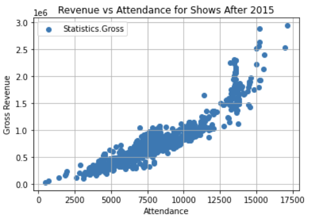

### Bar Plot
Bar plots are useful to see counts of categorical variables.

We create a bar plot using the `pyplot.bar` function, specifying the x coordinates (categories) and the height of the bars (values).

As with other Matplotlib plotting functions, <font color=red>pyplot.bar expects numpy arrays as inputs.</font> We will need to convert our pandas data objects to numpy.array objects prior to plotting.

```python
import numpy as np

# Create a numpy array for the categories
cat = np.array( showsByType.index.values )
print(cat)  
>> ['Musical' 'Play' 'Special']

# Convert the count table into a numpy array
ht = showsByType.to_numpy()
print(ht)
>>[20728  8112   327]

plt.bar( cat, ht )

plt.xlabel( "Show Type" )
plt.ylabel( "Occurrence of Shows" )

plt.show()
``````
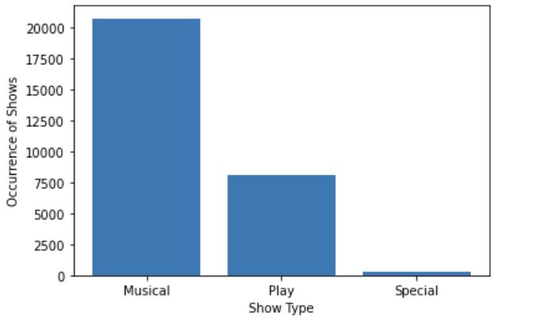

### Stacked Bar Plot
We can create a stacked bar plot using `pyplot.subplots`, essentially by drawing a plot on top of another.

```python
# TODO: Modify the Matplotlib example, using the numpy arrays you created above for the two theaters as the counts items
fig, ax = plt.subplots()

type_map = ("Musical","Play","Special") # the x-label

print(htWK)
>> array([532, 226,  53], dtype=int64)
print(htNS)
>> array([532, 226,  53], dtype=int64)

number = {"Walter Kerr":htWK, "Neil Simon":htNS} # the stacked label

width = 0.5
bottom = np.zeros(3)

for name,num in number.items():
    ax.bar(type_map,num,width,label=name,bottom=bottom)
    bottom += num

ax.set_xlabel("Show Type")
ax.set_ylabel("Occurence of Show")
ax.legend()

plt.show()
``````
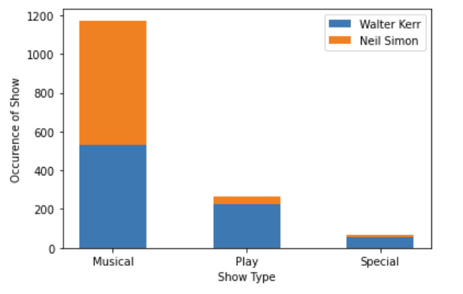

### Pie Chart
Pie Chart
Pie chart is an intuitive way to see proportions in data.

```python
plt.pie( revenueByShows[ "Statistics.Gross" ], labels = revenueByShows.index, autopct = '%0.0f%%' )
``````
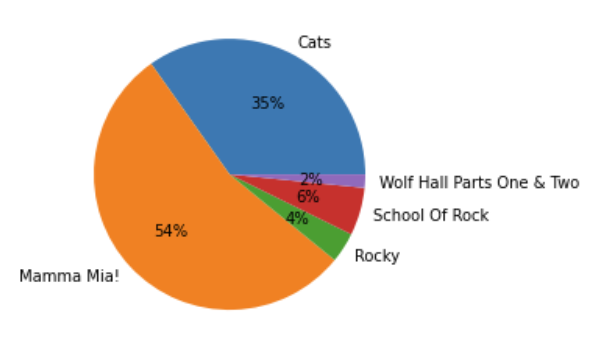


## Introduction to Seaborn
Seaborn绘图函数根据图形层级分为两种类型：
- axes级：绘图函数在单个axes上绘图，函数返回值就是axes对象。
- figure级：绘图函数在figure上绘图，返回一个FacetGrid对象，类似Figure对象，可以管理figure。

seaborn绘图函数根据功能可以分为关系绘图、统计绘图、分组绘图等，每组功能都提供了一个figure级函数（可以实现所有本组函数绘图功能，api统一），同时提供若干个axes级函数。


- relplot(关系绘图)：figure级函数
  - scatterplot：axes级函数（散点图）
  - lineplot：axes级函数（折线图）
- displot（分布统计绘图）：figure级函数
    - histplot：axes级函数（直方图）
    - kdeplot：axes级函数（核密度图）
    - ecdfplot：axes级函数（累积分布图）
    - rugplot：axes级函数（地毯图）    
- catplot（类别统计绘图）：figure级函数
    - striplot：axes级函数（分类散点条图）
    - swarmplot：axes级函数（分类散点簇图）
    - boxplot：axes级函数（箱形图）
    - violinplot：axes级函数（提琴图）
    - barplot：axes级函数（柱形图）
    - pointplot：axes级函数（分类统计点图）
- 两个特殊的figure级函数(多图组合)
  - jointplot：figure级函数，返回JointGrid对象。同时绘制3个子图，在绘制二维图的基础上，在图行上方和右侧绘制分布图。
  - pairplot：figure级函数，返回PairGrid对象。（配对分布统计图）

### Begin with Seaborn
The `set_theme` function sets the matplotlib parameters and hence the theme will now apply to all plots using matplotlib - whether plotted through seaborn or not. This is also the default theme.
```python
import seaborn as sns
sns.set_theme()
``````


### Relational Functions
#### Scatter Plot
```python
sns.scatterplot(data = showsAfter2015
                ,x = 'Statistics.Attendance'
                ,y='Statistics.Gross'
                ,hue='Show.Type')
#hue : 对输入数据进行分组的序列，将生成不同颜色来区分数据。

```
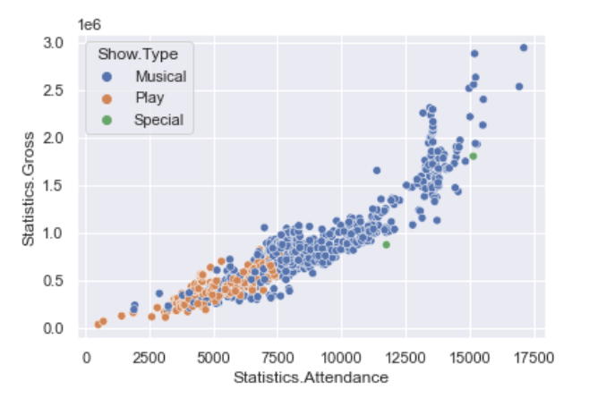

#### Relplot
Use the hue and style arguments to visualize the different theatres and show types respectively.
```python
sns.relplot(data = showsAfter2015, x='Statistics.Attendance', y='Statistics.Gross', hue='Show.Theatre' , style='Show.Type' )
# style:对输入数据进行分组的序列，将生成不同形状的点来区分数据。
``````
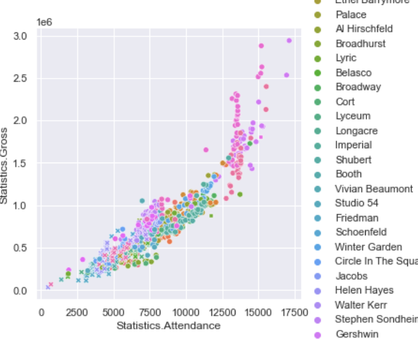


#### Scatter + Estimating Regression using `lmplot`
the scatter plot in the above exercises can be further enhanced using Seaborn lmplot to include a linear regression model (and its uncertainty).

the lmplot function draws a scatter plot of two variables, x and y, and then fit the regression model y ~ x and plot the resulting regression line and a 95% confidence interval for that regression.
```python
sns.lmplot(data=showsAfter2015, x='Statistics.Attendance' , y='Statistics.Gross' )
``````


#### Distributional Functions
In the distributional module, one of the axes-level function is kdeplot, while the figure-level function is displot.

##### KDE Plot
The kdeplot function is a kernel density estimate plot to visualise the distribution of observations in a dataset.
```python
sns.kdeplot( data=shows, x="Date.Year", hue="Show.Type", multiple="stack" )
``````
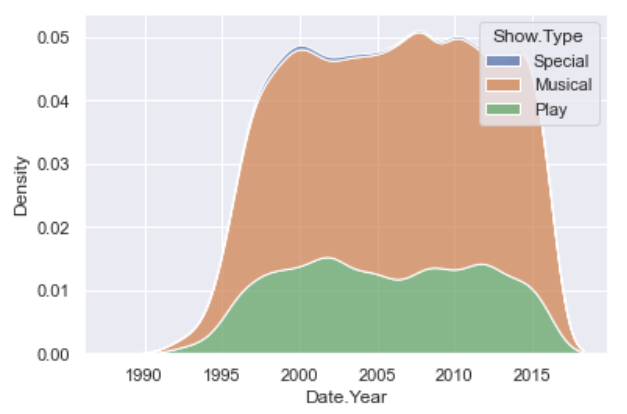


#### Displot
the displot function can be used to display bar plots along with distribution estimates (a KDE plot).
```python
sns.displot( data=shows, x="Date.Year", col="Show.Type", kde=True )
``````
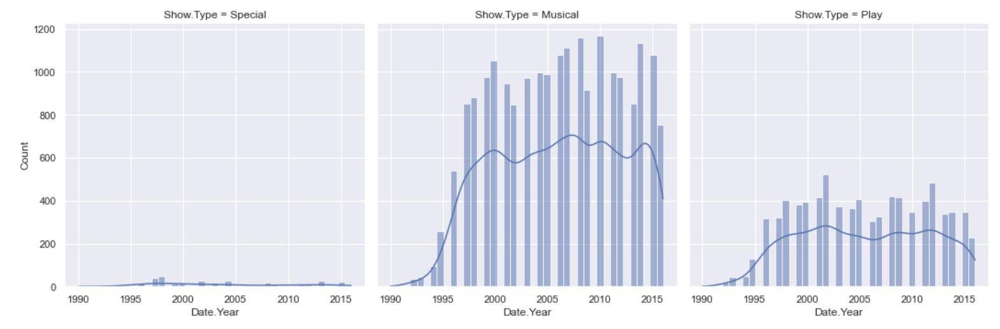


#### Jointplot
Seaborn jointplot is a function cannot be categorized neatly, as it can be used to plot a relationship between two variables while simultaneously exploring the distribution of each underlying variable.

```python
sns.jointplot( data=shows, x="Statistics.Attendance", y="Statistics.Gross", hue="Show.Type" )
``````
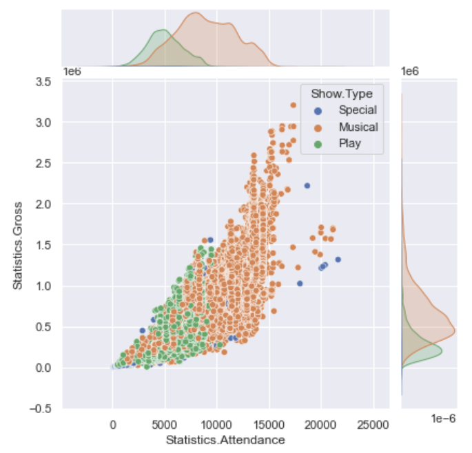


### Categorical Functions
Categorical plotting functions visualize the distribution with respect to categories.
#### Boxplot
Boxplots are plots that show the distribution of a dataset based on its five-number summary of data points: the minimum, first quartile (Q1), median, third quartile (Q3), and the maximum. Boxplots also show us the outliers, whether the data is symmetrical, how tightly the data is grouped, and if and how the data is skewed.

```python
sns.boxplot(x=shows['Statistics.Attendance'],y=shows['Date.Month'])
``````
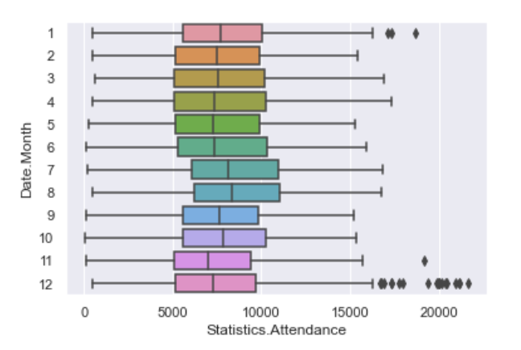

#### Countplot
shows the counts of observations in each categorical bin using bars. A countplot can be thought of as a histogram across a categorical, instead of quantitative, variable.
```python
sns.countplot(x=shows['Date.Month'] , hue =shows['Show.Type'] )
``````
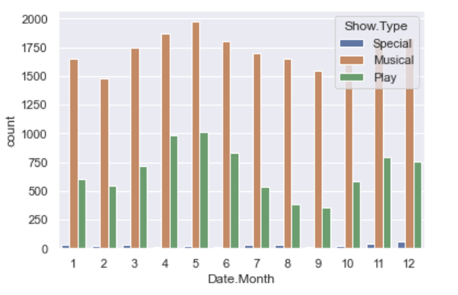


#### Catplot
```python
sns.catplot( data=shows, kind="box", x="Statistics.Attendance", y="Date.Month", hue="Show.Type" )
``````
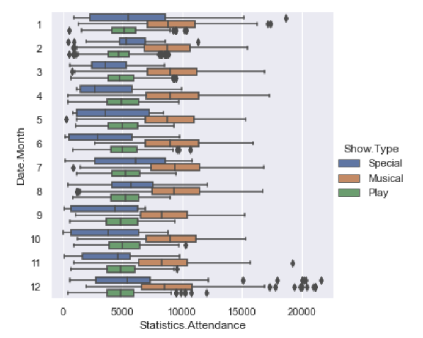

#### Conclusion
- In seaborn, as soon as specify the columns, we don't have to set the label. It will create the legend for you

- Use seaborn, the data must come from pandas (DataFrame, Series)


# Lecture 3 数据预处理

**数据质量**
- 缺失值
- 噪声
- 离群点

**数据预处理**
- 数据清洗
- 数据
- 数据转换

**数据降维**
- 基于启发式的技术
- PCA主成分分析

## 1. 数据质量
有三个维度去衡量数据的质量：**完整性、准确性和一致性**。

完整性 受缺失值影响
准确性受
一致性受 


数据不一致性的原因主要有以下三种：一是由于数据冗余造成的；二是由于并发控制不当造成的；三是由于各种故障、错误造成的。

第一种情况的出现往往是由于重复存放的数据未能进行一致性地更新造成的。例如教师工资的调整，如果人事处的工资数据已经改动了，而财务处的工资数据未改变，就会产生矛盾的工资数。

### 1.1 缺失值
成因：
- 属性未收集到
- 属性不可用

```python
# 查看每个属性的缺失值个数
df.isna().sum()
```

解决方案：
- 移除含有缺失值的数据样本
- 移除含有缺失值的特征属性 （如果某属性有80-90%都是缺失的）
- 进行数据推断（均值/中值填充、合理推断）

数据推断例子：
HDB的年限是99年，数据中有购买的年份，但剩余年限这一属性有着较多的缺失值。可以通过公式得到剩余年限：=当前年份 + 99 - 购买年份


### 1.2 噪声数据
成因：
- 数据输入错误
- 数据转换错误
- 数据格式不一致
- 数据单位不一致

解决办法：
- 探索性数据分析
- 使用基本的数据统计描述技术(例如，盒图或者散点图)和数据可视化方法来识别可能代表噪声的离群点。

### 1.3 离群点
一、离群点是噪声
- 负面影响分析
- 移除离群点或使用方法降低离群点的影响

二、离群点是目标
- 是学习的目标
- 如：欺诈检测测和异常检测


## 2. 数据预处理
Key Steps
- **Data Cleaning**
  - Remove or fill missing values
  - Identify and remove outliers (如果异常检测，outlier不可移除，是target)
  - identify and remove/merge duplicates
  - correct errors and inconsistencies
- **Data Reduction**
  - Reducing the number of datapoints
    - sampling 
    - commonly used for preliminary analysis
    - commonly used when dataset extremely large
  - Reducing the number of attributes
    - removing irrelevant attributes
    - dimensionality reduction
  - Reducing the number of attributes values
    - aggregation or generalization
    - binning and smoothing
  
Data aggregation 

